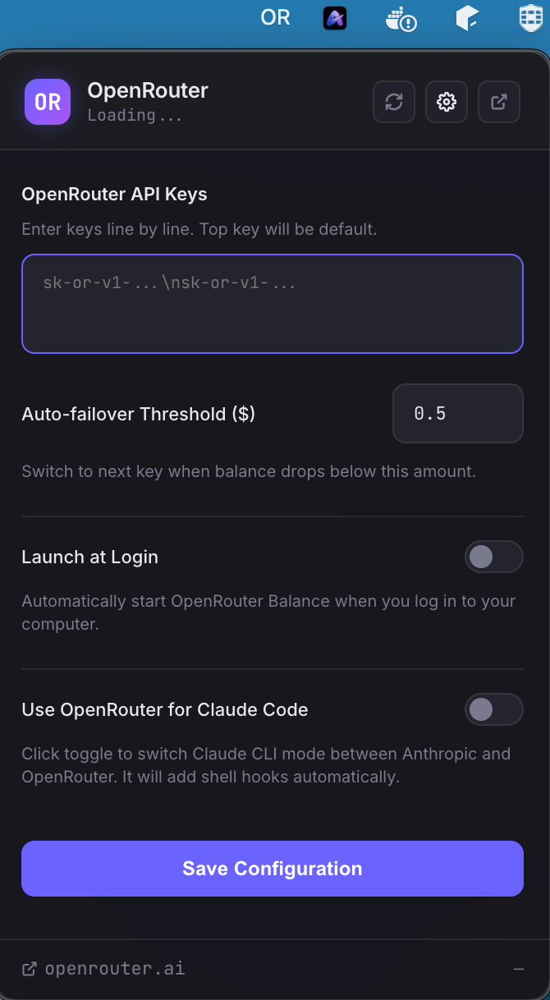
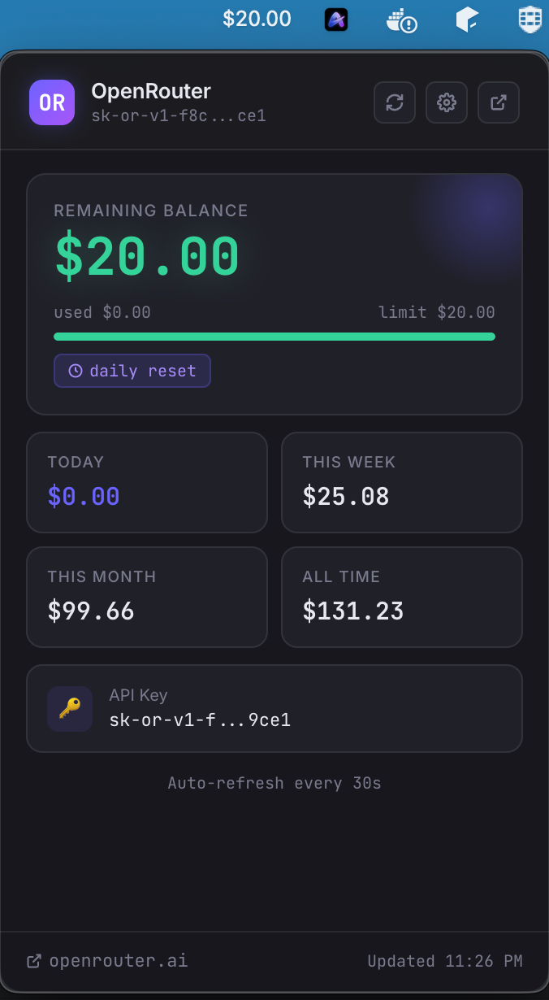

# 🟣 OpenRouter Balance

> A lightweight macOS menu bar app that displays your OpenRouter API balance and usage stats in real time.


---

## 🎯 What it does

Lives quietly in your menu bar and shows your remaining OpenRouter credit at a glance. Click it to expand a panel with detailed usage stats — daily, weekly, and monthly. No browser tab needed.

```
Menu bar:  $10.26   ←  remaining balance, color-coded
```

Clicking opens a beautifully designed popup with a dark glassmorphism theme:

- Remaining balance (green → yellow → red based on percentage)
- Progress bar against your daily limit
- Daily / weekly / monthly / all-time usage breakdown
- API key label
- Auto-refreshes every 30 seconds

---

## 📸 Preview

>  &nbsp;&nbsp;&nbsp; 

---

## 🚀 Features & Capabilities

- **UI-based Configuration:** No need to tinker with shell variables or system paths. Simply open the app and paste your API key in the settings panel. Your key is stored securely within the app's local `userData` config.
- **Auto Launch at Login:** Seamlessly start the app when your Mac boots up. Just toggle the switch in settings—no manual LaunchAgent `plist` files required!
- **Dark Glassmorphism Theme:** A premium, modern, and blurred interface that looks native on macOS.

---

## ⚙️ Requirements

- macOS 12+
- Node.js 18+ (for development)
- An [OpenRouter API key](https://openrouter.ai/settings/keys)

---

## 💻 Installation & Development

### Using Homebrew (Recommended)

You can easily install the pre-built application using Homebrew:

```bash
brew install volkankurt2/tap/openrouter-menubar
```

### Manual Development Setup

```bash
# 1. Clone the repository
git clone https://github.com/volkankurt2/openrouter-menubar.git
cd openrouter-menubar

# 2. Install dependencies
npm install

# 3. Run directly (development)
npm start
```

*When you first run the app, the settings panel will automatically open and prompt you for an OpenRouter API key.*

---

## 📦 Build as a standalone `.app`

To create a distributable disk image (`.dmg`) and macOS Application (`.app`):

```bash
npm run build
```

The output will be placed in the `dist/` folder (e.g., `OpenRouter Balance-1.0.0-arm64.dmg`). You can drag the generated app into your `/Applications` folder!

---

## 🛠️ Project Structure

```text
openrouter-menubar/
├── main.js        # Electron main process (tray, API polling, IPC, config & auto-launch)
├── popup.html     # Popup UI (glassmorphism dark theme, settings view toggle)
├── package.json   # Dependencies and build configuration
└── README.md
```

---

## 🌐 API

Uses the official OpenRouter authenticated endpoint:

```http
GET https://openrouter.ai/api/v1/auth/key
Authorization: Bearer sk-or-v1-...
```

Response fields parsed and used: `limit`, `limit_remaining`, `limit_reset`, `usage`, `usage_daily`, `usage_weekly`, `usage_monthly`, `label`.

---

## 🔧 Troubleshooting

**"API_KEY_NOT_SET" message / Settings panel keeps appearing**
Open the settings by clicking the gear icon in the top right corner, paste your valid OpenRouter API key, and click "Save Configuration".

**App doesn't appear in the menu bar**
Make sure you're running macOS 12+. Try quitting the Electron process and restarting with `npm start` to check for terminal errors.

---

## 📄 License

MIT.
